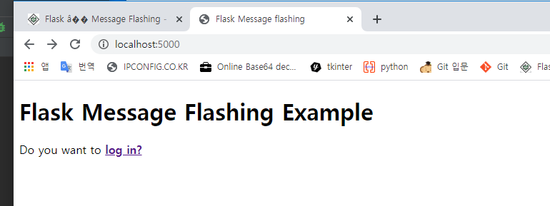
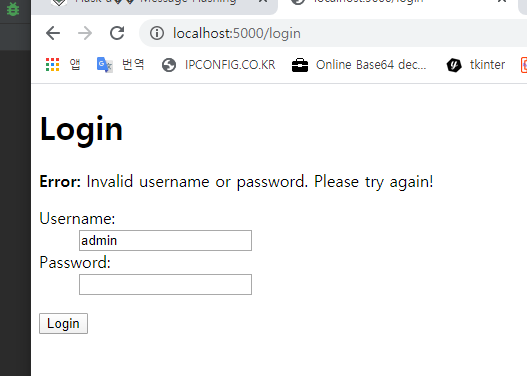
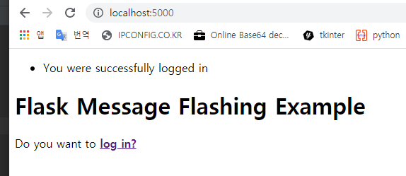
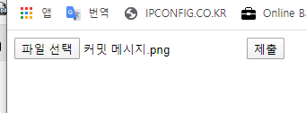
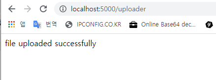
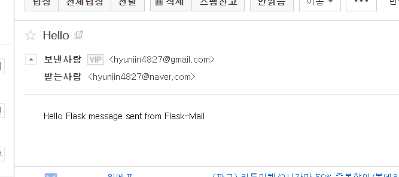

## Flask Tutorial / 04_10 금 (페이지 4)

- #### Flask - Message Flashing

```
좋은 GUI기반 어플리케이션은 상호작용에 대해 사용자에게 피드백을 제공한다.
예를 들어 desktop 어플리케이션에서 다이얼로그 혹은 메세지 박스를 사용, 
자바 스크립트와 유사한 목적으로 경고를 사용한다.

플라스크 어플리케이션에서는 이러한 정보 메세지를 쉽게 생성할 수 있다.
플라스크 프레임워크의 플레싱 시스템이 이러한 메세지를 만들어 보여주고 렌더링하는 함수를 호출가능하게 한다.

플라스크 모듈에는 flash() 메소드가 포함되어있다. 
일반적으로 템플릿인 다음 요청에 메세지를 전달한다.
flash(message, category)

message  : 실제로 플래시(보여줄) 메세지이다.
category : 선택사항 인자이다. 'error', 'into', 'warning' 사용가능  

템플릿에서 get_flashed_messages() 호출하여 세션으로부터 순서대로 메세지를 제거한다.
get_flashed_messages(with_categories, category_filter)

두 매개변수는 모두 선택사항이다.
첫번째 인자는 수신된 메세지에 범주가 있는경우 튜플이다.
두번째 인자는 특정 메세지만 보여주는 유용한 것이다.
```

flask.py

```python
from flask import Flask, redirect, url_for, render_template, request, flash

app = Flask(__name__)
app.secret_key = "random string"


@app.route('/')
def index():
    return render_template('index.html')


@app.route('/login', methods=['GET', 'POST'])
def login():
    error = None

    if request.method == "POST":
        if request.form['username'] != 'admin' or request.form['password'] != 'admin':
            error = 'Invalid username or password. Please try again!'
        else:
            flash('You were successfully logged in')
            return redirect(url_for('index'))
    return render_template('login.html', error=error)


if __name__ == "__main__":
    app.run()
```

index.html

```html
<!doctype html>
<html>
   <head>
      <title>Flask Message flashing</title>
   </head>
   <body>
      
         
            <ul>
               
               <li>{{ message }}</li>
               
            </ul>
         
      

      <h1>Flask Message Flashing Example</h1>
      <p>Do you want to <a href = "{{ url_for('login') }}">
         <b>log in?</b></a></p>
   </body>
</html>
```

login.html

```html
<!doctype html>
<html>
   <body>
      <h1>Login</h1>

      
         <p><strong>Error:</strong> {{ error }}
      

      <form action = "" method = post>
         <dl>
            <dt>Username:</dt>
            <dd>
               <input type = text name = username
                  value = "{{request.form.username }}">
            </dd>
            <dt>Password:</dt>
            <dd><input type = password name = password></dd>
         </dl>
         <p><input type = submit value = Login></p>
      </form>
   </body>
</html>
```







***

- #### Flask - File Uploading

```
플라스크에서 파일 업로드 처리는 매우쉽다.
enctype 속성이 'multipart/form-data'로 설정되어 파일을 URL에 게시하는 HTML양식이 필요하다.
URL 핸들러는  request.files[] 객체와 원하는 위치로 저장함으로 파일을 가져온다.

업로드된 파일은 최종적으로 저장하기 전에 서버 위에 일시적인 위치에 먼저 저장된다.
대상 파일의 이름은 하드 코딩되거나 request.files[file] 객체의 파일 이름 속성으로부터 얻는다.
그러나, secure_filename() 함수를 사용하여 보안 버전을 얻는걸 권한다.
Flask 객체의 구성 설정에서 기본 업로드 폴더의 경로와 업로드된 파일의 최대 크기를 정의할 수 있다.
```

| app.config['UPLOAD_FOLDER']    | 업로드 폴더의 경로를 정의한다.                      |
| ------------------------------ | --------------------------------------------------- |
| app.config['MAX_CONTENT_PATH'] | 업로드 할 파일의 최대크기를 바이트 단위로 지정한다. |

upload.py

```python
from flask import Flask, render_template, request
from werkzeug.utils import secure_filename

app = Flask(__name__)
# 파일 업로드 용량 제한 16MB
app.config['MAX_CONTENT_LENGTH'] = 16 * 1024 * 1024

@app.route('/upload')
def upload():
    return render_template('upload.html')


@app.route('/uploader', methods=['GET', 'POST'])
def upload_file():
    if request.method == 'POST':
        f = request.files['file']
        f.save(secure_filename(f.filename))
        return 'file uploaded successfully'


if __name__ == '__main__':
    app.run()
```

upload.html

```html
<!DOCTYPE html>
<html>
   <body>
      <form action = "http://localhost:5000/uploader" method = "POST"
         enctype = "multipart/form-data">
         <input type = "file" name = "file" />
         <input type = "submit"/>
      </form>
   </body>
</html>
```





***

- #### Flask - Extensions

```
플라스크는 마이크로 프레임워크라고 자주 불린다.
WSGI 및 Werkzeug 기반 라우팅 및 Jinja2 기반 템플릿 엔진이 포함되므로 플라스크는 종종 마이크로 프레임워크라고 한다.
또한 플라스크 프레임워크는 쿠기 및 세션뿐만 아니라 JSON, static파일 등과 같은 웹도우미를 지원한다.
플라스크 확장은 python 모듈이며 플라스크 응용프로그램에 특정 유형의 지원을 추가한다.
Flask Extension Registry는 사용가능한 확장 디렉토리이다. 
필요한 확장자는 pip 유틸리티로 다운로드 할수 있다.

Flask Mail - 플라스크 어플리케이션에 SMTP 인터페이스 제공
Flask WTF  - WTForms 렌더링 및 유효성 검사 추가
Flask SQLAlchemy - Flask 어플리케이션에 SQLAlchemy 지원 추가 
Flask Sijax - sijax 용 인터페이스 - 웹어플리케이션에서 AJAX를 쉽게 사용할 수 있게 해주는 Python/jquery 라이브러리

각 유형의 확장은 일반적으로 사용법에 대해 광범위한 문서를 제공한다.
확장은 파이썬 모듈이므로 그것을 사용하려면 가져와야한다. 플라스크 확장은 일반적으로 flask-foo로 명명
from flask_foo import [class, function]

Flasd 0.7 버전 이후의 경우 다음 구문도 사용가능
from flask.ext import foo

이를 사용하려면 호환성 모듈을 활성화해야한다. flaskext_compat.py를 실행하여 설치 가능
import flaskext_compat
flaskext_compat.activate()
from flask.ext import foo
```

***

- #### Flask - Mail

```
웹 기반 응용 프로그램에는 종종 사용자 / 클라이언트에게 메일을 보내는 기능이 필요하다.
Flask-Mail 확장을 사용하면 모든 전자 메일서버와 간단한 인터페이스를 쉽게 설정할 수 있다.

설치
pip install Flask-Mail
다음 응용 프로그램 매개변수의 값을 설정하여 Flask-Mail을 구성
```

| Sr.No. | 매개변수 및 설명                                             |
| ------ | ------------------------------------------------------------ |
| 1      | MAIL_SERVER : 이메일 서버의 이름 / IP주소                    |
| 2      | MAIL_PORT : 사용된 서버의 포트번호                           |
| 3      | MAIL_USE_TLS : 전송 보안계층 암호화 활성화 / 비활성화        |
| 4      | MAIL_USE_SSL : SSL(Secure Sockets Layer) 암호화 활성화 / 비활성화 |
| 5      | MAIL_DEBUG : 디버그 지원, 기본값은 플라스크 어플리케이션의 디버그 상태 |
| 6      | MAIL-USERNAME : 발신자의 사용자 이름                         |
| 7      | MAIL_PASSWORD : 발신자 비밀번호                              |
| 8      | MAIL_DEFAULT_SENDER : 기본 발신자 설정                       |
| 9      | MAIL_MAX_EMAILS : 보낼 최대 메일을 설정                      |
| 10     | MAIL_SUPPRESS_SEND : app testing이 true로 설정된 경우 전송이 억제된다. |
| 11     | MAIL_ASCII_ATTACHMENTS : true로 설정하면 첨부 된 파일 이름이 ASCII로 변환된다. |

__Mail Class__

```python
flask-mail.Mail(app = None)
```

생성자는 Flask 응용프로그램 객체를 매개변수로 사용한다.

| Sr.No | 방법및 설명                                    |
| ----- | ---------------------------------------------- |
| 1     | send()  : Message 클래스 객체의 내용을 보낸다. |
| 2     | connect()  : 메일 호스트와 연결을 연다.        |
| 3     | end_message()  : 메세지 객체를 보낸다.         |

__Message Class Method__

- attach() 
  - 메세지에 첨부 파일을 추가한다.  다음과 같은 매개변수 사용
    - filename - 첨부할 파일이름 
    - content-type - 파일의 MIME 유형
    - data - 원시 파일 데이터
    - disposition - 콘텐츠 처리 (있는 경우)
- add_recipient()
  - 다른 수신자를 메세지에 추가

```python
from flask import Flask
from flask_mail import Mail, Message

app =Flask(__name__)
mail=Mail(app)

app.config['MAIL_SERVER']='smtp.gmail.com'
app.config['MAIL_PORT'] = 465
app.config['MAIL_USERNAME'] = 'yourId@gmail.com'
app.config['MAIL_PASSWORD'] = '*****'
app.config['MAIL_USE_TLS'] = False
app.config['MAIL_USE_SSL'] = True
mail = Mail(app)

@app.route("/")
def index():
   msg = Message('Hello', sender = 'yourId@gmail.com', recipients = ['id1@gmail.com'])
   msg.body = "Hello Flask message sent from Flask-Mail"
   mail.send(msg)
   return "Sent"

if __name__ == '__main__':
   app.run(debug = True)
```




