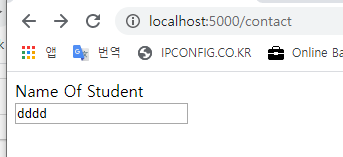
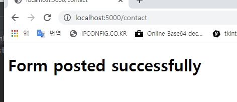
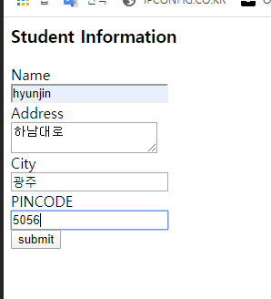
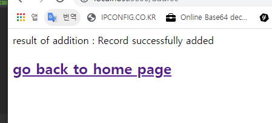
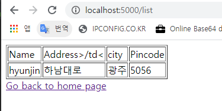

## Flask Tutorial 04_11 토 (page 6)

- ### Flask - WTF

```
웹 응용프로그램의 필수 측면 중 하나는 사용자에게 사용자 인터페이스를 제공 하는것.
HTML은 인터페이스를 디자인하는데 사용되는 <form> 태그를 제공한다.
텍스트 입력, 라디오, 선택 등의 양식 요소를 적절하게 사용할 수 있다.
사용자가 입력한 데이터는 Http 요청 메시지형태로 GET 또는 POST 메소드를 통해 서버 측 스크립트에 제출된다.

Flask-WTF를 사용하여 Python 스크립트에서 양식 필드를 정의하고 HTML 템플릿을 사용하여 렌더링 할 수 있다.
WTF 필드에 유효성 검사를 적용할 수도 있다.

설치
pip install flask-WTF

설치된 패키지에는 사용자 정의 양식의 상위로 사용해야 하는 Form 클래스가 포함되어 있다.
WTforms 패키지에는 다양한 양식 필드의 정의가 포함되어 있다. 일부 표준 양식 필드가 아래에 나열
```

모듈 import 라이브러리 

| Sr.No | Standard Form Fields & Description                           |
| ----- | ------------------------------------------------------------ |
| 1     | TextField : <입력 유형 = '텍스트'> HTML 양식 요소를 나타냄   |
| 2     | BooleanField : <입력 유형='확인란'> HTML 양식 요소를 나타냄  |
| 3     | DecimalField : 십진수로 숫자를 표시하기 위한 텍스트 필드     |
| 4     | IntegerField : 정수를 표시하기위한 TextField                 |
| 5     | RadioField : <입력 유형='라디오'> HTML양식 요소를 나타낸다.  |
| 6     | SelectField : 선택 양식요소를 나타냄                         |
| 7     | TextAreaField :  <testarea> HTML양식요소를 나타낸다          |
| 8     | PasswordField :  <입력유형='비밀번호'> HTML 양식 요소를 나타낸다 |
| 9     | SubmitField : <입력 유형='제출'> 양식 요소를 나타낸다        |

```python
# 텍스트 필드를 포함하는 양식
from flask_wtf import Form
from wtforms import TextField

class ConteactForm(Form):
    name = TextField("Name Of Student")
```

'이름 ' 핑드 외에도 CSRF 토큰의 숨겨진 필드가 자동으로 작성된다.

이는 사이트간 요청 위조 공격을 방지하기 위한 것이다. 렌더링될때 아래와 같이 HTML 스크립트가 생성된다.

```html
<input id = "csrf_token" name = "csrf_token" type = "hidden" />
<label for = "name">Name Of Student</label><br>
<input id = "name" name = "name" type = "text" value="" />
```

```python
from flask import Flask, render_template
from form import ContactForm

app = Flask(__name__)
app.secret_key = "development key"

@app.route('/contact')
def contact():
    form = ContactForm()
    return render_template('contact.html', form = form)

if __name__ == '__main__':
    app.run()
```



WTForms 패키지에는 유효성 검사기 클래스도 포함되어있다.

양식 필드에 유효성 검사를 적용하는 데 유용함. 다음 목록은 일반적으로 사용되는 유효성 검사기를 보여준다.

| Sr.No | 검증 자 클래스 및 설명                                       |
| ----- | ------------------------------------------------------------ |
| 1     | **DataRequired** 입력 필드가 비어 있는지 확인                |
| 2     | **email** 필드의 텍스트가 이메일 ID 규칙을 따르는 지 확인    |
| 3     | **IPAddress** 입력 필드에서 IP 주소를 확인합니다             |
| 4     | **Length** 입력 필드의 문자열 길이가 지정된 범위에 있는지 확인 |
| 5     | **NumberRange** 주어진 범위 내에서 입력 필드의 숫자를 확인   |
| 6     | **URL**입력 필드에 입력 한 URL을 확인합니다                  |

app.py

```python
from flask import Flask, render_template, request, flash
from form import ContactForm

app = Flask(__name__)
app.secret_key = "development key"


@app.route('/contact', methods=['GET', 'POST'])
def contact():
    form = ContactForm()

    if request.method == "POST":
        if form.validate() == False:
            flash("All fields are required.")
            return render_template('contact.html', form=form)
        else:
            return render_template('success.html')
    elif request.method == 'GET':
        return render_template('contact.html', form=form)


if __name__ == '__main__':
    app.run()
```

form.py

```python
from flask_wtf import Form
from wtforms import TextField, IntegerField, TextAreaField, SubmitField, RadioField, SelectField
from wtforms import validators, ValidationError


class ContactForm(Form):
    name = TextField("Name Of Student", [validators.Required("Please enter your name.")])
    Gender = RadioField('Gender', choices = [('M','Male'),('F','Female')])
    Address = TextAreaField("Address")

    email = TextField("Email", [validators.Required("Please enter your email address."),
                                validators.Email("Please enter your email address.")])
    Age = IntegerField("age")
    language = SelectField('Languages', choices = [('cpp','C++'), ('py','Python')])
    submit = SubmitField("Send")

```

contact,html

```html
<!doctype html>
<html>
   <body>
      <h2 style = "text-align: center;">Contact Form</h2>

      
         <div>{{ message }}</div>
      

      
         <div>{{ message }}</div>
      

      <form action = "http://localhost:5000/contact" method = post>
         <fieldset>
            <legend>Contact Form</legend>
            {{ form.hidden_tag() }}

            <div style = font-size:20px; font-weight:bold; margin-left:150px;>
               {{ form.name.label }}<br>
               {{ form.name }}
               <br>

               {{ form.Gender.label }} {{ form.Gender }}
               {{ form.Address.label }}<br>
               {{ form.Address }}
               <br>

               {{ form.email.label }}<br>
               {{ form.email }}
               <br>

               {{ form.Age.label }}<br>
               {{ form.Age }}
               <br>

               {{ form.language.label }}<br>
               {{ form.language }}
               <br>
               {{ form.submit }}
            </div>

         </fieldset>
      </form>
   </body>
</html>
```




***

- ### Flask - SQLite

  - 참고링크 : [SQLite - Python](https://www.tutorialspoint.com/sqlite/sqlite_python.htm)

```
파이썬은 SQlite를 기본적으로 지원한다.
SQlite3 모듈은 Python 배포판과 함께 제공된다. Python에서 SqLite 데이터베이스를 사용하는 방법에는 자세한 자습서는 이링크 참고 
이 섹션에서는 Flask 애플리케이션이 SQLite와 상호작용하는 방식을 알아본다.
SQLite 데이터베이스 'database.db'를 만들고 여기에 학생 테이블을 만든다.
```

1. database.db 만들고 학생 테이블 생성 하기 

```python
import sqlite3

conn = sqlite3.connect('database.db')
print("Opened database successfully")

conn.execute("CREATE TABLE students (name TEXT, addr TEXT, city TEXT, pin TEXT)")
print("Table created successfully")
conn.close()
```

```python
from flask import Flask, render_template, request
import sqlite3 as sql
app = Flask(__name__)

@app.route('/')
def home():
   return render_template('home.html')

@app.route('/enternew')
def new_student():
   return render_template('student.html')

@app.route('/addrec',methods = ['POST', 'GET'])
def addrec():
   if request.method == 'POST':
      try:
         nm = request.form['nm']
         addr = request.form['add']
         city = request.form['city']
         pin = request.form['pin']
         
         with sql.connect("database.db") as con:
            cur = con.cursor()
            
            cur.execute("INSERT INTO students (name,addr,city,pin) 
               VALUES (?,?,?,?)",(nm,addr,city,pin) )
            
            con.commit()
            msg = "Record successfully added"
      except:
         con.rollback()
         msg = "error in insert operation"
      
      finally:
         return render_template("result.html",msg = msg)
         con.close()

@app.route('/list')
def list():
   con = sql.connect("database.db")
   con.row_factory = sql.Row
   
   cur = con.cursor()
   cur.execute("select * from students")
   
   rows = cur.fetchall();
   return render_template("list.html",rows = rows)

if __name__ == '__main__':
   app.run(debug = True)
```







***

- ### Flask - SQLAIchemy

```
Flask 프로그램에서 윈시 SQL을 사용하여 데이터베이스에서 CRUD 작업을 수행하는것은 번거로울 수 있다.
대신 Python 툴킷인 SQLAlchemy는 강력한 OR Mapper로 애플리케이션 개발자에게 SQL의 모든기능과 유연성을 제공한다. Flask-SQLalchemy는 Flask 응용프로그램에 SQLAlchemy에 대한 지원을 추가한다.

ORM(Object Relation Mapping)이란 무엇인가?
대부분의 프로그래밍 언어 플랫폼은 객체지향적이다. 반면 RDBMS 서버의 데이터는 테이블로 저장된다.
오브젝트 관계 맵핑은 오브젝트 매개변수를 기본 RDBMS 테이블 구조에 맵핑하는 기술이다. 
ORM API는 원시 SQL문을 작성하지 않고 CRUD조작을 수행하는 메소드를 제공한다.

```

app.py

```python
from flask import Flask, request, flash, url_for, redirect, render_template
from flask_sqlalchemy import SQLAlchemy

app = Flask(__name__)
app.config['SQLALCHEMY_DATABASE_URI'] = 'sqlite:///students.sqlite3'
app.config['SECRET_KEY'] = "random string"

db = SQLAlchemy(app)

class students(db.Model):
   id = db.Column('student_id', db.Integer, primary_key = True)
   name = db.Column(db.String(100))
   city = db.Column(db.String(50))
   addr = db.Column(db.String(200)) 
   pin = db.Column(db.String(10))

def __init__(self, name, city, addr,pin):
   self.name = name
   self.city = city
   self.addr = addr
   self.pin = pin

@app.route('/')
def show_all():
   return render_template('show_all.html', students = students.query.all() )

@app.route('/new', methods = ['GET', 'POST'])
def new():
   if request.method == 'POST':
      if not request.form['name'] or not request.form['city'] or not request.form['addr']:
         flash('Please enter all the fields', 'error')
      else:
         student = students(request.form['name'], request.form['city'],
            request.form['addr'], request.form['pin'])
         
         db.session.add(student)
         db.session.commit()
         flash('Record was successfully added')
         return redirect(url_for('show_all'))
   return render_template('new.html')

if __name__ == '__main__':
   db.create_all()
   app.run(debug = True)
```

***

- ### Flask - Sijax

```
Sijax는 'Simple AJAX' 그리고 그것은 파이썬 /의 jQuery 쉽게 가져올수 있도록 설계 라이브러리 Ajax를 응용프로그램에 사용 jQuery.ajax를 AJAX 요청을 할수 있다.
```

```python
import os

import flask_sijax
from flask import Flask, g, render_template
from flask_sijax import sijax

path = os.path.join('.', os.path.dirname(__file__), 'static/js/sijax/')
app = Flask(__name__)

app.config['SIJAX_STATIC_PATH'] = path
app.config['SIJAX_JSON_URI'] = '/static/js/sijax/json2.js'
flask_sijax.Sijax(app)


@app.route('/')
def index():
    return 'Index'


@flask_sijax.route(app, '/hello')
def hello():
    def say_hi(obj_response):
        obj_response.alert('Hi there!')

    if g.sijax.is_sijax_request:
        # Sijax request detected - let Sijax handle it
        g.sijax.register_callback('say_hi', say_hi)
        return g.sijax.process_request()
    return render_template('sijaxexample.html')


if __name__ == '__main__':
    app.run(debug=True)
```

***

- ### Flask – Deployment

```
외부에서 볼수 있는 서버
개발 서버의 Flask 응용프로그램은 개발 환경이 설정된 컴퓨터에서만 액세스할 수 있다.
디버깅 모드에서는 사용자가 컴퓨터에서 임의의 코드를 실행할 수 있기 때문에 이것은 기본동작이다.
디버그를 사용하지 않으면 호스트 이름을 '0.0.0.0'으로 설정하여 네트워크의 사용자가 로컬 컴퓨터의 개발서버를 사용할수 있다.
app.run(host='0.0.0.0')
이로서 운영 체제는 모든 공용 IP를 listen 한다.
```