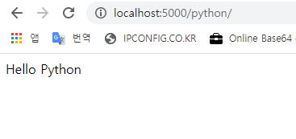

## Flask tutorial / 4월 8일 수요일

- ### Flask - Variable Rules(변수 조정)

```
매개변수 규칙에 변수를 추가함으로 URL을 동적으로 만들수 있다.
이 변수 부분은 <variable-name>으로 표시할수 있다.

예제를 따라하면 route() 데코레이터의 매개변수 규칙은 '/hello' URL을 추가해 <name> 변수 부분이 포함된다. 따라서 브라우저에서 http://localhost:5000/hello/TutorialsPoint를 URL로 입력하면 hello()함수에 인수로 'TutorialPoint'가 제공된다.
```

```python
from flask import Flask

app = Flask(__name__)

@app.route('/hello/<name>')  # '/URL/<변수>'
def hello_name(name):
    return 'Hello %s!' % name


if __name__ == '__main__':
    app.run(debug=True)
    
```

result

```
FLASK_APP = app.py
FLASK_ENV = development
FLASK_DEBUG = 0
In folder C:/Users/82105/PycharmProjects/Flask_Tutorial
C:\Users\82105\PycharmProjects\Flask_Tutorial\venv\Scripts\python.exe -m flask run
 * Serving Flask app "app.py"
 * Environment: development
 * Debug mode: off
 * Running on http://127.0.0.1:5000/ (Press CTRL+C to quit)
127.0.0.1 - - [08/Apr/2020 14:30:26] "GET /hello HTTP/1.1" 404 -
127.0.0.1 - - [08/Apr/2020 14:30:56] "GET /hello/TutorialsPoint HTTP/1.1" 200 -
127.0.0.1 - - [08/Apr/2020 14:31:05] "GET /hello/hyunjin HTTP/1.1" 200 -
```


```
위의 스크립트에서 hello.py 저장하고 파이썬 쉘에서 실행해라. 
다음 브라우저에서 URL주소를 "http://localhost:5000/hello/TutorialsPoint" 검색하여라.
기본적으로 문자열 변수 부분에 추가하는데, 다음 표의 구성대로 규칙을 구성할수 있다.
```

| Sr.No. | Converters & Description                              |
| ------ | ----------------------------------------------------- |
| 1      | int : 정수를 받아들인다.                              |
| 2      | float : 부동 소수점 값                                |
| 3      | path : 디렉토리 구분문자로 사용되는 슬래시를 허용한다 |

```python
from flask import Flask
app = Flask(__name__)

# int example
@app.route('/blog/<int:postID>')
def show_blog(postID):
   return 'Blog Number %d' % postID

# float example
@app.route('/rev/<float:revNo>') 
def revision(revNo):
   return 'Revision Number %f' % revNo

@app.route('/flask')
def hello_flask():
   return 'Hello Flask'

@app.route('/python/')
def hello_python():
   return 'Hello Python'


if __name__ == '__main__':
   app.run()
```




```
@app.route('/flask')
def hello_flask():
   return 'Hello Flask'

@app.route('/python/')
def hello_python():
   return 'Hello Python'

두 개의 규칙은 비슷해 보이지만 두번째 규칙에서 후행 슬래시가 사용된다.
결과적으로 표준 URL이 된다. 따라서 /python 또는 /python/을 사용하면 동일한 출력이 반환된다.
그러나 첫 번째의 경우 /flask/ URL은 404 찾을 수 없음 페이지가 나온다.
```


- ### Flask - URL Building

```
url_for() 함수는 URL을 동적으로 만드는데 아주 유용하다.
이 함수는 함수의 이름을 첫번째 인수로, 하나 이상의 키워드 인수를 각각 URL 변수부분에 해당된다.
```

```python
from flask import Flask, redirect, url_for
app = Flask(__name__)

@app.route('/admin')
def hello_admin():
   return 'Hello Admin'

@app.route('/guest/<guest>')
def hello_guest(guest):
   return 'Hello %s as Guest' % guest

@app.route('/user/<name>')
def hello_user(name):
   if name =='admin': 
      return redirect(url_for('hello_admin'))
   else:
      return redirect(url_for('hello_guest',guest = name))

if __name__ == '__main__':
   app.run(debug = True)
```


```
위 스크립트는 URL에서 인수로 값을 받는 user(name)함수를 가진다.
이 User()함수는 받은 인수가 'admin'인지 아닌지 체크한다. 이 응용프로그램은 url_for() 함수를 사용하고 hello_admin()로 리다이렉트 한다.
```

리다이렉트 개념 : https://doublesprogramming.tistory.com/63


- ### Flask - HTTP methods

  - [http method 검색](https://developer.mozilla.org/ko/docs/Web/HTTP/Methods)
  - [GET, POST 차이](https://blog.outsider.ne.kr/312)

```
HTTP 프로토콜은 www의 데이터 통신의 기초이다.
지정된 URL에서 각각 다른 데이터 검색방법이 프로토콜에 정의되어있다.
```

| Sr.No. | 메서드 및 설명                                               |
| ------ | ------------------------------------------------------------ |
| 1      | GET       : 가장 일반적인 방법, 암호화되지 않은 데이터를 서버로 보낸다 (데이터양 적을떄?) |
| 2      | HEAD    : GET과 동일하지만, 응답 본문이 없다                 |
| 3      | POST     : HTML 데이터형식을 서버로 보내는데 사용한다. POST로 받은 데이터는 서버에 의해 키시되지 않는다. |
| 4      | PUT       :  대상 자원의 모든 현재 표현을 업로드 된 컨텐츠로 바꾼다. |
| 5      | DELETE : URL이 제공한 대상 자원의 현재 표현을 모두 제거      |

```
기본적으로 플라스크 route는 GET 요청에 응답한다.
그러나 route() 데코레이터에 메소드 인수를 제공하여 이 환경 설정을 변경할 수 있다.
URL 라우팅에서 POST 메소드 사용을 보여주기 위해 먼저 HTML 양식을 작성하고 POST 메소드를 사용하여 양식 데이터를 URL로 보낸다.
```

```html
<html>
   <body>
      <form action = "http://localhost:5000/login" method = "post">
         <p>Enter Name:</p>
         <p><input type = "text" name = "nm" /></p>
         <p><input type = "submit" value = "submit" /></p>
      </form>
   </body>
</html>
```

```python
from flask import Flask, redirect, url_for, request
app = Flask(__name__)

@app.route('/success/<name>')
def success(name):
   return 'welcome %s' % name

@app.route('/login',methods = ['POST', 'GET'])
def login():
   # Post 요청
   if request.method == 'POST':
      user = request.form['nm']
      return redirect(url_for('success',name = user))
   # Get 요청
   else: 
      user = request.args.get('nm')
      return redirect(url_for('success',name = user))

if __name__ == '__main__':
    app.run()
```


```
서버가 실행된 후 브라우저에서 login.html을 열고 텍스트 필드에 name을 입력 후 submit 클릭
데이터 양식은 태크 양식의 URL에 POST된다.
http://localhost:5000/login은 login() 함수에 매핑된다.
서버가 POST 방법으로 데이터를 수신 했으므로 데이터 양식에서 얻은 'nm' 매개변수 값은 

user = request.form['nm']     --> Post요청
user = request.args.get['nm'] --> Get요청
변수는 '/success' URL에 전달된다. 마지막으로 브라우저가 창에 표시를 한다.
```


- ### Flask - templates

```
HTML형식으로 특정 URL에 바인딩된 함수의 출력을 반환할 수 있다.
예를 들어 다음 스크립트에서 hello() 함수는 <h1>태그가 첨부된 'Hello World'를 렌더링한다.
파이썬 코드에서 HTML 컨텐츠를 생성하는 것은 성가신 일. 
특히 변수 데이터와 조건부 또는 루프와 같은 파이썬 언어 요소를 넣어야 할 때 더욱 그렇다. HTML에서 자주 이스케이프 해야한다.
Flask의 기반이되는 Jinja2 템플릿 엔진을 활용할 수 있다. 
함수에서 하드 코드 HTML을 반환하는 대신 render_template() 함수로 HTML 파일을 렌더링 할수있다.

'web templating system'은 변수 데이터를 동적으로 삽입할 수 있는 HTML 스크립트를 설계하는 것을 말한다.
웹 템플릿 시스템은 템플릿 엔진, 어떤 종류의 데이터 소스 그리고 템플릿 프로세서로 구성된다.

개발 서버가 시작되면 브라우저를 열고 URL을 다음과 같이 입력 하십시오
http://localhost:5000/ hello/mvl
URL 의 변수 부분은 {{name}} 자리 표시 자에 삽입된다.
```

```python
from flask import Flask, render_template

app = Flask(__name__)

@app.route('/hello/<user>')
def hello_name(user):
    return render_template('hello.html', name=user)


if __name__ == '__main__':
    app.run()
```

```html
<!doctype html>
<html>
   <body>

      <h1>Hello {{ name }}!</h1>

   </body>
</html>
```


```
Jinja2의 템플릿 엔진은 HTML에서 이스케이프를 위해 다음과 같은 구분 기호 사용.
- 명령문의 경우 : 
- 템플릿 출력으로 인쇄할 표현식의 경우 {{...}}
- 템플릿 출력에 포함되지않은 주석의 경우 {#...#}
- #... ## 줄 설명 
```


- ### Flask - static file

```
웹 응용프로그램에는 종종 웹 페이지를 표시를 지원하는 JavaScript 파일 또는 CSS 파일과 같은 정적파일이 필요하다. 보통 웹서버는 사용자를 위해 서비스를 제공해주도록 구성되어 있지만 개발 중에 이러한 파일은 패키지의 정적 폴더 또는 모듈 옆에 제공되며 응용 프로그램의 /static 에서 사용할 수 있다.

정적 파일에 대한 URL을 생성하는 데 특수 엔드 포인트 'static'이 사용된다.
다음 예제 에서 hello.js에 정의 된 자바 스크립트함수 는 index.html 의 HTML 버튼 OnClick 이벤트에서 호출되며 이는 Flask 애플리케이션의 '/' URL에 렌더링된다.
```

app.py

```python
from flask import Flask, render_template

app = Flask(__name__)

@app.route('/')
def index():
    return render_template('index.html')


if __name__ == '__main__':
   app.run(debug = True)
```

index.html

```html
<html>
   <head>
      <script type = "text/javascript"
         src = "{{ url_for('static', filename = 'hello.js') }}" ></script>
   </head>

   <body>
      <input type = "button" onclick = "sayHello()" value = "Say Hello" />
   </body>
</html>
```

hello.js

```js
function sayHello(){
    alert("Hello World")
}
```


