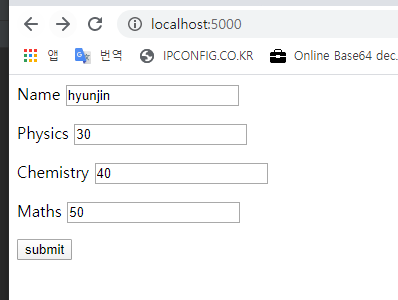
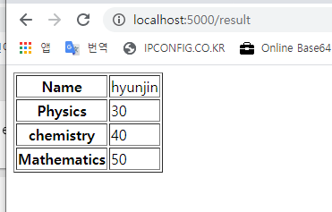
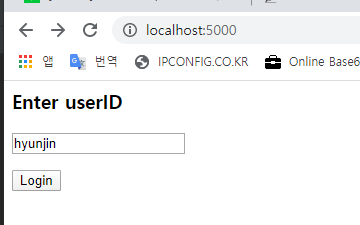
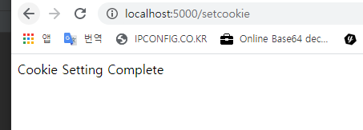
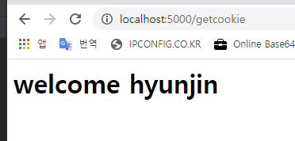

## Flask tutorial / 4월 9일 목 

- ### Flask - Request Object

```
클라이언트 웹페이지의 데이터는 전역 요청 객체로 서버에 전송된다.
요청 데이터를 처리하려면 플라스크 모듈에서 요청 데이터를 가져와야한다.
요청 객체의 속성은 다음과 같다.

- Form : key와 value를 매개변수 양식과 그것들의 값이 딕셔너리 객체에 포함된다.
- args : 물음표(?) 다음에 URL의 일부인 쿼리 문자열의 구문 분석된 내용
- Cookies : 쿠키 이름과 값을 보유하는 딕셔너리 객체 
- files : 업로드된 파일과 관련 데이터 
- method : 현재 요청 메서드
```

- ### Flask - Sending Form Data to Template

```
우리는 URL규칙의 http method를 할줄안다. 
이 triggered 함수로부터 Form 데이터를 받을 수 있다. 
딕셔너리 객체의 형태로 수집할 수 있고 해당 웹페이지를 랜더링하기 위해 템플릿을 전달할 수 있다.
다음 예제에서 '/' URL은 양식이 있는 웹페이지를 렌더링한다. 
채워진 데이터는 '/result' URL에 게시되어 result() 함수를 트리거한다.

results() 함수는 데이터를 수집 존재양식으로 Request.Form 딕셔너리 객체를 렌더링 하고 보낸다.
result.html 템플릿 Form 데이터의 HTML을 동적으로 렌더링한다.
```

app.py

```python
from flask import Flask, render_template, request
app = Flask(__name__)

@app.route('/')
def student():
   return render_template('student.html')

@app.route('/result',methods = ['POST', 'GET'])
def result():
   if request.method == 'POST':
      result = request.form
      return render_template("result.html",result = result)

if __name__ == '__main__':
   app.run(debug = True)
```

student.html

```html
<html>
   <body>
      <form action = "http://localhost:5000/result" method = "POST">
         <p>Name <input type = "text" name = "Name" /></p>
         <p>Physics <input type = "text" name = "Physics" /></p>
         <p>Chemistry <input type = "text" name = "chemistry" /></p>
         <p>Maths <input type ="text" name = "Mathematics" /></p>
         <p><input type = "submit" value = "submit" /></p>
      </form>
   </body>
</html>
```

result.html (템플릿 코드)

```html
<!doctype html>
<html>
   <body>
      <table border = 1>
         
            <tr>
               <th> {{ key }} </th>
               <td> {{ value }} </td>
            </tr>
         
      </table>
   </body>
</html>
```



submit 클릭 시 HTML 테이블양식에 Form data 가 result.html에 렌더링 된다.




- ### Flask - Cookies

```
쿠키는 클라이언트 컴퓨터에 텍스트 파일의 형식으로 저장된다.
이 목적은 방문자 경험과 사이트 통계를 위한 관련된 데이터 추적을 기억하는데 사용된다.

Request 객체는 쿠키의 속성에 포함되어 있다.
클라이언트가 전송한 모든 쿠기변수와 해당값의 딕셔너리 객체이다.
또한 쿠키는 사이트의 만료시간, 경로 및 도메인 이름도 저장한다.

플라스크에서 쿠키가 Request객체에 설정된다.
뷰 함수의 반환값에서 응답객체를 가져오려면 make_response()를 사용해라.
그런다음 응답객체의 set_cookie() 함수를 사용하여 쿠키를 저장해라.

쿠키를 다시 읽는것은 쉽다.
request.cookies 속성의 get()메소드는 쿠키를 읽는데 사용한다.
```

```python
from flask import Flask, render_template, request, make_response

app = Flask(__name__)

@app.route('/')
def index():
   return render_template('index.html')


@app.route('/setcookie', methods=['POST', 'GET']) -> methods로 써야함 
def setcookie():
    if request.method == 'POST':
        user = request.form['nm']

    # make_response()
    # 사용자에게 반환할 뷰 함수를 생성한 후, 그대로 묶어두는 역할 
   	# 뷰를 보여주기 전에 쿠키를 생성해야 하므로 위 함수로 묶어두었다.
    resp = make_response(render_template('readcookie.html'))
    
    # set_cookie() : 쿠키생성
    # 쿠키의 이름은 'userID'이며, 내용에는 폼으로 입력된 문자열이 들어간다.
    # 그 후 해당 뷰 객체를 반환하여 보여주게 하였다.
    resp.set_cookie('userID', user)

    return resp

@app.route('/getcookie')
def getcookie():
   name = request.cookies.get('userID')
   return '<h1>welcome '+name+'</h1>'


if __name__=='__main__':
    app.run()
```

index.html

```html
<html>
   <body>
      <form action = "/setcookie" method = "POST">
         <p><h3>Enter userID</h3></p>
         <p><input type = 'text' name = 'nm'/></p>
         <p><input type = 'submit' value = 'Login'/></p>
      </form>
   </body>
</html>
```

readcookie.html

```html
<html>
   <body>
        <form action = "/getcookie" method="POST">


        </form>
   </body>
</html>
```







- ### Flask - Sessions

```
쿠키와 마찬가지로 세션 데이터는 클라이언트에 저장된다.
세션은 클라이언트가 서버로 로그인하고 로그아웃하는 시간 간격이다.
이 세션에서 유지해야하는 데이터는 클라이언트 브라우저에 저장된다.

각각의 클라이언트에게 세션ID를 할당한다. 이 세션 데이터는 쿠키위에 저장되고 서버는 암호화하여 서명한다.
이 암호화를 위해 플라스크 프로그램은 정의된 SECRET_KEY가 필요하다.
세션 객체는 또한 세션 변수와 관련 값의 키-값 쌍을 포함하는 딕셔너리 객체이다.
```

```python
# 세션 변수 설정
Session['username'] = 'admin'

# 세션 변수 해제 : pop 메소드 사용
session.pop('username', None)
```

```python
from flask import Flask, request, session, redirect, url_for

app = Flask(__name__)
app.secret_key = 'any random string'


@app.route('/')
def index():
    if 'username' in session:
        username = session['username']
        return 'Logged in as ' + username + '<br>' + \
            "<b><a href = '/logout'>click here to log out</a></b>"

    return "You are not logged in <br><a href = '/login'></b>" + \
        "click here to log in </b></a>"


@app.route('/login', methods=['GET', 'POST'])
def login():
    if request.method == 'POST':
        session['username'] = request.form['username']
        return redirect(url_for('index'))
    return '''
    
    <form action = "" method = "post">
        <p><input type = text name = username/></p>
        <p><input type = submit value = Login/></p>
    </form>
    
    '''


@app.route('/logout')
def logout():
    session.pop('username', None)
    return redirect(url_for('index'))


if __name__ == '__main__':
    app.run()
```

```
login() 뷰함수에서 /login을 검색할때 GET 메소드를 통해 호출되므로 로그인 양식을 연다.
양식이 '/login' 으로 다시 게시되고 이제 세션 변수가 설정된다. 
응용 프로그램이 '/'로 리다이렉션된다.
```


- ### Flask - Redirect & Errors

```
플라스크 클래스는 redirect() 함수를 가진다.
이 함수를 호출하면 응답객체를 반환하고 지정된 코드를 사용하여 사용자를 또다른 대상위치로 리다이렉션한다.

Flask.redirect(location, statuscode, response)
위 함수에서 
	location   : 매개변수는 응답을 리다이렉션 해야하는 URL이다.
	statuscode : 브라우저의 헤더에 기본값 302을 보낸다.
	response   : 매개변수는 응답을 인스턴스화 하는데 사용한다.
	
HTTP_300_MULTIPLE_CHOICES
HTTP_301_MOVED_PERMANENTLY
HTTP_302_FOUND
HTTP_303_SEE_OTHER
HTTP_304_NOT_MODIFIED
HTTP_305_USE_PROXY
HTTP_306_RESERVED
HTTP_307_TEMPORARY_REDIRECT

다음 예제에서 redirect() 함수는 로그인 시도가 실패할 때 로그인 페이지를 다시 표시하는 데 사용된다.
```

```python
from flask import Flask, redirect, url_for, render_template, request
# Initialize the Flask application
app = Flask(__name__)

@app.route('/')
def index():
   return render_template('log_in.html')

@app.route('/login',methods = ['POST', 'GET']) 
def login(): 
   if request.method == 'POST' and request.form['username'] == 'admin' :
      return redirect(url_for('success'))
   else:
      return redirect(url_for('index'))

@app.route('/success')
def success():
   return 'logged in successfully'
	
if __name__ == '__main__':
   app.run(debug = True)
```

```
Flask.abort(code)
플라스크 클래스에는 오류 코드와 함께 abort () 함수가 있다.

400- 잘못된 요청
(401) - 인증되지 않은에 대한
403- 금지
404- 찾을 수 없음
406- 허용되지 않음
415- 지원되지 않는 미디어 유형
429- 너무 많은 요청
```


