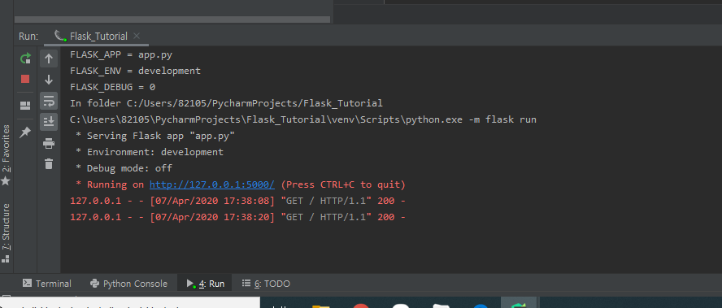
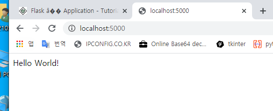

## Flask_tutorial / 2020_04_07 화

- [[Google] : Flask 튜토리얼 사이트](https://www.tutorialspoint.com/flask/index.htm)

- Flask - Home

```
플라스크는 파이썬으로 쓴 웹 어플리케이션 프레임 워크이다 
플라스크 튜토리얼은 파이썬 기초지식과 웹 사이트 개발촉구를 가져야 할사람들에게 준비되어있다.

이 튜토리얼을 완성 후 Flask를 사용하여 웹사이트를 개발하는데 전문지식을 찾을수 있을 것이다.

튜로리얼을 진행하기 전에 우리는 HTML과 Python에 대한 실습 경험이 있다고 가정하자
만약 니가 HTML, Python 개념을 잘 모르는 경우 간단한 자습서를 진행하는 것이 좋다.
```

- Flask - Overview

```
웹 프레임워크란?
플라스크는 웹 어플리케이션 프레임워크 또는 간단한 웹 프레임워크는 웹 응용 개발자가 프로토콜, 스레드 관리 등과 같은 하위 수준 세부정보를 신경쓸 필요없이 응용 프로그램을 작성할 수 있도록하는 라이브러리 와 모듈을 나타낸다.

플라스크란 무엇인가?
플라스크는 파이썬 언어로 작성한 웹 어플리케이션 프레임워크이다.
Armin Ronacher(아민 로나허)에 개발되었고 그는 Pocco라는 파이썬 프로젝트 국제적인 그룹의 리더이다.
플라스크는 Werkzeug WSGI toolkit과 Jinja2 템플릿 엔진 기반이다. 둘 다 Pocco 프로젝트 이다.

WSGI
WSGI(Web Server Gateway Interface) 파이썬에서 어플리케이션, 즉 파이썬 스크립트(웹 어플리케이션)가 웹 서버와 통신하기 위한 인터페이스입니다. 

Werkzeug
요청,응답 오브젝트 그리고 기타 유틸리티 기능들을 구현한 WSGI toolkit이다.
이는 웹 프레임워크의 상위에 구축할수 있다.

Jinja2
Jinja2는 널리 사용하는 파이썬용 템플릿 엔진이다.
웹 템블릿 시스템은 어떤 데이터소스와 함께 템플릿을 결합으로 동적 웹페이지 랜더링한다.

플라스크는 마이크로 프레임워크로 종종 가르킨다.
응용 프로그램의 핵심은 단순하면서 확장가능하게 유지하는 것을 목표로 한다.
플라스크에는 데이터베이스 처리를 위한 기본 추상화 계층이 없으며, 유효성 검사도 지원하지 않는다.
대신 플라스크는 이러한 기능을 응용 어플리케이션에 추가하기 위한 확장을 지원한다.
```


- Flask - Environment

```
전제 조건
플라스크의 설치는 보통 파이썬 2.6이상 요구한다.
플라스크가 python3에서 의존성작업이 좋을지라도 많은 플라스크에서 확장 프로그램이 제대로 지원하지 않는다. 따라서 플라스크는 파이썬 2.7에 설치하는 것이 좋다
```

- 개발 환경을 위한 virtualenv 설치

```
virtualenv는 가상 파이썬 환경 빌더이다.
이것은 사용자가 여러 파이썬 환경을 만들수 있도록 도와준다.
따라서 다른 버전의 라이브러리 사이의 호환성 문제를 피할수 있다.
```

```linux
sudo apt-get install virtualenv // in ubuntu linux
윈도우에서는 관리자 로그인 


```


- Flask - Application

  - hello.py
    - WIN10에서 Pycharm tool로 Flask 프로젝트 생성하였습니다. 

  ```python
  from flask import Flask
  app = Flask(__name__)
  
  @app.route('/')
  def hello_world():
  	return 'Hello World'
  	
  	
  if __name__ == '__main__':
  	app.run()
  ```

  

```
프로젝트에 플라스크 모듈추가는 필수이다.
플라스크 클래스의 오브젝트는 WSGI 응용어플리케이션이다.
플라스크 생성자는 현재 모듈의 이름 (__name__)을 인수로 사용한다.

플라스크 클래스에 route() 함수는 데코레이터이다.
데커레이터(Decorator)는 하나의 함수를 취해서 또 다른 함수를 반환하는 함수이다.
응용 프로그램에 어떤 함수가 연결된 함수를 호출해야하는 URL을 알려준다.

# app.route(rule, options)
rule 매개변수는 URL의 기능을 결합이다.
option은 기본 규칙 객체에 전달되는 매개변수의 목록이다.

이 예제에서 '/' URL은 hello_world() 함수를 바운드한다.
따라서 이 웹서버의 홈페이지가 브라우저에서 열릴 때,  
이 함수의 출력이 렌더링된다.
마지막으로 플라스크 클래스의 run()메서드가 로컬 개발서버에서 어플리케이션을 실행한다.

# app.run(host, port, debug, options)
```

| Sr.No. | Parameters & Description                                     |
| ------ | ------------------------------------------------------------ |
| 1      | host      : 수신할 호스트 이름,  기본값은 127.0.0.1(로컬), 서버를 외부에서 사용할수 있게 하려면 '0.0.0.0' 으로 설정해야함 |
| 2      | port       : 기본값 5000번                                   |
| 3      | debug   : 기본값은 false, 값이 true일때 디버그 정보 제공     |
| 4      | options : 기본 Werkzeug 서버로 전달된다                      |

```
Python Hello.py
# 이 파이썬 스크립트는 파이썬 쉘에서 실행 명령 
```

```
* Running on http://127.0.0.1:5000/ (Press Ctrl+C to quit)
# 이 메세지는 파이썬 쉘이 너에게 보여준다 
# 브라우저 위에 localhost:5000을 열어라 'Hello World' 메세지가 표시될 것이다.
```

- 참고 링크  : [파이썬 데코레이터](https://whatisthenext.tistory.com/113)



```
디버그 모드
app.debug = True
app.run()
app.run(debug = True)

플라스크 프로그램은 run() 메소드에 의해 시작된다.
그러나 이 프로그램을 개발하는 동안 코드가 변경 될때마다 수동으로 다시 시작해야한다.
(소스코드를 수정하면 수동으로 재시작을 해줘야하는 불편함이 따름)

이 불편을 피하려면 디버그 지원을 사용해라. 그런 다음 코드가 변경되면 서버는 다시 로드된다.
또한 응용 프로그램에서 오류들을 추적할수 있는 디버거기능을 제공한다.

디버그 모드는 디버그 매개 변수를 실행하거나 run() 메소드에 전달하기 전에 어플리케이션 오브젝트의 디버그 특성을 True로 설정하여 사용가능하다. 

```

- 디버그 모드로 설정해놓으면 파이썬에서 발생한 모든 오류가 출력 되므로 보안취약해기 때문에 정식 서비스할때는 설정으 해제하라고 한다.
  - flask debug mode 검색 - [https://hudi.kr/flask-%EB%94%94%EB%B2%84%EA%B7%B8-%EB%AA%A8%EB%93%9C-%EC%84%A4%EC%A0%95/](https://hudi.kr/flask-디버그-모드-설정/)


- Flask - Routing

```
최신 웹 프레임워크는 라우팅 기술을 사용하여 사용자가 응용 프로그램 URL을 기억하도록 도와준다.
흠페이지를 탐색하지 않고도 원하는 페이지에 직접 액세스하는 것이 좋다.
Flask의  route() 데코레이터는 URL을 함수에ㅐ 바인딩하는 데 사용된다.
```

```python
# Ex)

@app.route('/hello')
def hello_world():
    return 'hello world'
```

```
여기서 URL '/hello' 규칙은 hello_world() 함수에 바인딩된다.
결과적으로 사용자가 http://localhost:5000/hello URL을 방문하면 hello_world() 함수의 출력이 브라우저에 렌더링된다.

응용프로그램 객체의 add_url_rule() 함수를 사용하여 위 예제와 같이 URL을 함수와 바인딩 할 수도 있다.
다음과 같이 제공된다.
```

```python
def hello_world():
	return 'hello world'

app.add_url_rule('/', 'hello', hello_world) # 
```

